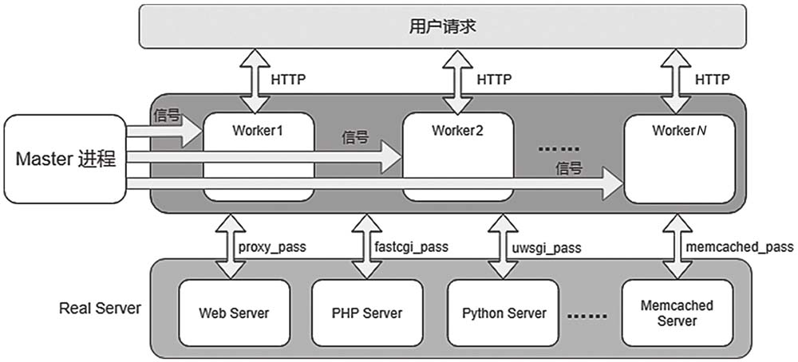
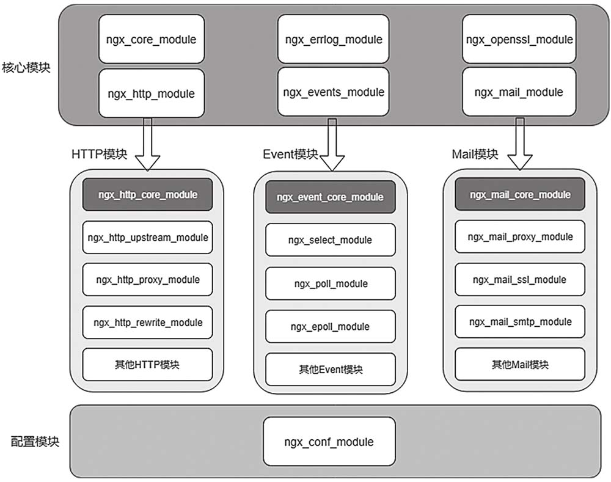

### Nginx介绍
Nginx是一款高性能的Web服务器，最初由俄罗斯程序员Igor Sysoev开发，自2004年问世以来，凭借其高性能、高可靠、易扩展等优点，在反向代理、负载均衡、静态文件托管等主流场合得到了广泛的应用。

Nginx具有以下优点。
- 高性能：相比于其他Web服务器如Apache，在正常请求以及高峰请求期，可以更快地响应请求。
- 高可靠：Nginx采用多进程模型，分为主进程和工作进程。主进程负责监视工作进程，当工作进程异常退出时，可以快速拉起一个新的工作进程，从而为用户提供稳定服务
- 高并发：Nginx通常作为网关级服务，其支持的并发量通常在万级别，经过优化甚至可以达到十万级别。
- 易扩展：Nginx是模块化设计，具有极高的扩展性，使用者可以根据自身需求，定制开发相应模块。
- 热部署：Nginx提供了优雅重启以及平滑升级的方案，使用户在修改配置文件或者升级Nginx时，不会影响线上服务。
- 跨平台：支持Linux、Windows、macOS多种平台。

### Nginx基础架构
#### 多进程模型
Nginx使用了Master管理进程和Worker工作进程（Worker进程）的设计，如下图

nginx工作时，会生成一个master进程和若干个worker进程。master进程主要负责读取、应用配置，并管理worker进程。worker进程负责处理请求。master与worker之间采用基于事件的通信模式。多进程模型的设计充分利用了多核处理器的并发能力。
##### 异步非阻塞
Nginx的Worker进程全程工作在异步非阻塞模式下。从TCP连接的建立到读取内核缓冲区里的请求数据，再到各HTTP模块处理请求，或者反向代理时将请求转发给上游服务器，最后再将响应数据发送给用户，Worker进程几乎不会阻塞。
当某个系统调用发生阻塞时（例如进行I/O操作，但是操作系统还没将数据准备好），Worker进程会立即处理下一个请求。当处理条件满足时，操作系统会通知Worker进程继续完成这次操作。
一个请求可能需要多个阶段才能完成，但是整体上看每个Worker进程一直处于高效的工作状态，因此Nginx只需要少数Worker进程就能处理大量的并发请求。

##### CPU绑定
通常在生产环境中会配置Nginx的Worker进程数量等于CPU核心数，同时会通过worker_cpu_affinity将Worker进程绑定到固定的核上，让每个Worker进程独享一个CPU核心，这样既能有效避免CPU频繁地上下文切换，也能大幅提高CPU的缓存命中率。

##### Worker进程的负载均衡机制
当客户端试图与Nginx服务器建立连接时，如果每个Worker进程都争抢着去接受连接就会造成“惊群效应“，Worker进程都被操作系统唤醒，但最终却只有一个Worker进程成功接受连接，这会降低系统的整体性能。
此外，如果有的Worker进程总是争抢连接失败，而有的Worker进程本身已经很忙碌了，却争抢成功，就会造成Worker进程之间负载的不均衡，也会降低服务器的处理能力与吞吐量。
为了解决第一个问题，nginx引入了一把全局的accept_mutex锁，每个Worker进程在监听之前都会尝试获取accept_mutex锁，只有成功抢到锁的Worker进程才会真正监听端口并接受新的连接。
关于第二个问题，nginx采用了一套负载均衡算法，比较繁忙的Worker进程会放弃对accept_mutex锁的争抢，专注于处理已有的连接。
#### 模块化设计
Nginx由众多模块构成，每种模块各司其职，但所有的模块都遵循相同的接口规范，总体来说Nginx的模块按功能可以划分为如下5类:

- 核心模块：Nginx中最重要的一类模块，每个核心模块定义了同一种风格类型的模块，包括
```
ngx_core_module
ngx_http_module
ngx_events_module
ngx_mail_module
ngx_openssl_module
ngx_errlog_module
```
- HTTP模块：与处理HTTP请求密切相关的一类模块。数量最多的类型，Nginx的大量功能是通过HTTP模块实现的。
- Event模块：定义了一系列可以运行在不同操作系统、不同内核版本的事件驱动模块。Nginx的事件处理框架完美地支持各类操作系统提供的事件驱动模型，包括epoll、poll、select、kqueue、eventport等。
- Mail模块：与邮件服务相关的模块，提供了代理IMAP、POP3、SMTP等的能力。
- 配置模块：此类模块只有ngx_conf_module一个成员，是其他模块的基础，因为其他模块在生效前都需要依赖配置模块处理配置指令并完成各自的准备工作。配置模块指导所有模块按照配置文件提供功能，是Nginx可配置、可定制、可扩展的基础。

#### 事件驱动
Nginx全异步事件驱动框架是保障其高性能的重要基石。事件驱动框架通常由3部分组成：事件收集器、事件发生器和事件处理器。
Nginx主要处理的事件来自网络和磁盘，包括TCP连接的建立与断开、接收和发送网络数据包、磁盘文件的I/O操作等。
事件处理器作为消费者，负责接收分发过来的各种事件并处理。Nginx中每个模块都有可能成为事件消费者。
Event模块负责事件的收集、管理和分发。不同操作系统提供了不同事件驱动模型，例如Linux 2.6系统同时支持epoll、poll、select模型，FreeBSD系统支持kqueue模型，Solaris 10系统支持eventport模型。为了保证其跨平台特性，Nginx的事件驱动框架可以支持各类操作系统的事件驱动模型。针对每一种模型，Nginx设计了一个Event模块，如ngx_epoll_module、ngx_poll_module、ngx_select_module等。事件驱动框架会在模块初始化时根据操作系统选取一个合适的Event模块，Linux环境下，Nginx默认选择性能最强的epoll模型。

### Nginx的配置与启动
#### 在docker容器中运行nginx
```
docker run --name nginx-demo --rm \
-p 80:80 nginx
```
然后就可以通过localhost访问了, 80端口映射可省略。

#### Nginx的运行控制
使用`nginx -s signal`命令可以控制nginx的启停、重载配置等操作，其中signal为具体的动作：
```
stop — fast shutdown
quit — graceful shutdown
reload — reloading the configuration file
reopen — reopening the log files
```
相比stop命令，quit在停止nginx前首先等待worker进程处理完当前的请求。
reolad命令可以重新加载最新修改的配置文件。
master进程在收到reolad命令时，会首先检查配置文件的有没有语法错误，确认没问题就会给所有的worker进程发送停止命令，空闲中的worker进程会立即停止，而正在处理请求的worker进程也会在处理结束后停止。随后master进程会使用最新的配置启动新的一批worker进程。

前文的nginx容器启动后，在另一个terminal执行`docker exec -it nginx-demo /bin/bash`进入容器，然后就可以执行`nginx -s signal`命令了。

停止nginx除了使用`nginx -s quit`外，也可以使用kill命令，与quit命令一样，nginx也会优雅退出。
```
ps -ax | grep nginx # 查找nginx进程ID
kill -s QUIT <PID>
```
#### 配置文件的结构
配置文件可以包含简单指令和块指令：
- 简单指令为单条的指令，如`worker_processes  1;`，设置worker进程的数量，以分号结尾；
- 块指令包裹在`{ }`中，块指令内部可以包含简单指令或嵌套块指令，如events, http, server, location；
- 每个块指令都会有自己对应的context，最外层的简单指令属于main context；

#### 托管静态文件
首先拷贝nginx.conf文件
`docker container cp nginx-demo:/etc/nginx/nginx.conf ./cp`
修改为：
```
user  nginx;
worker_processes  1;

error_log  /var/log/nginx/error.log warn;
pid        /var/run/nginx.pid;


events {
    worker_connections  1024;
}

http {
    server {
        location / {
            root /usr/share/nginx/html;
        }
    }
}

```
然后创建`/nginx/www/index.html`文件，重新启动nginx容器并设置挂载项，宿主机目录需要修改为真实的目录：
```
docker run --name nginx-demo --rm \
-p 80:80 \
-v "$(pwd)"/nginx/www:/usr/share/nginx/html \
-v "$(pwd)"/nginx/conf/nginx.conf:/etc/nginx/nginx.conf \
-v "$(pwd)"/nginx/log:/var/log/nginx  \
nginx
```
再次访问localhost看到的就是自定义的index.html页面了。

#### Error Log
想要开启Error Log首先在build nginx时带上`--with-debug`指令，不过这里使用的docker镜像已经默认开启了Error Log，只需要启动容器时设置好挂载项`-v "$(pwd)"/nginx/log:/var/log/nginx`，并对应设置`error_log  /var/log/nginx/error.log error;`就可以查看error.log了。
设置使用的指令为`error_log file [level]`，如
```
error_log /path/to/log debug;

http {
    server {
        ...
```
log默认error级别，也可以手动指定为`debug, info, notice, warn, error, crit, alert, emerg`。这个指令支持的Context有`main, http, mail, stream, server, location`。

### Nginx如何处理请求
#### IP-based
首先会基于listen指定的IP地址和端口来定位虚拟主机：
```
server {
    listen      80;
    return 200 "a.com";
}

server {
    listen      81;
    return 200 "b.com";
}
```
#### Name-based
如果多个虚拟主机监听相同的端口，类似下面的配置，则会根据请求头中的**Host**字段找到与server_name匹配的虚拟主机：
```
server {
    listen      80;
    server_name a.com www.a.com;
    return 200 "a.com";
}

server {
    listen      80;
    server_name b.com www.b.com;
    return 200 "b.com";
}
```
如果找不到匹配，或者请求头中不包含**Host**字段，Nginx会默认将请求导向第一个虚拟主机。也可以使用**default_server**指定默认主机;
```
server {
    listen      80 default_server;
    server_name b.com www.b.com;
    return 200 "b.com";
}
```

### Server Names
匹配server_name时，除了精确匹配，还可以使用通配符或正则
#### 通配符(Wildcard names)匹配
使用*来替代开头、结尾的字符，如：
```
*.example.org // 可以匹配www.example.org, www.sub.example.org等
www.example.* // 可以匹配www.example.org, www.example.api.org等 
*.example.* // 不支持
```
`*.example.org`必须有前缀，如果既想匹配`*.example.org`, 又想匹配`example.org`，可以使用点号`.`,如`.example.org`, 但点号只能出现在前面；

#### 正则匹配
使用正则匹配时要以`~`开头，如：
```
~^w+\.c\.com$ // 可以匹配www.c.com, abc.c.com等
```
`^ $`,开头、结尾符号可以选择不加，但为了匹配精确性建议加上。
需要注意的是如果正则表达式使用了限定符`{ }`,则需要把整段表达式用引号括起来：
`"~^w{1,3}+\.c\.com$"`，否则nginx会报错`directive "server_name" is not terminated by ";" `
此外，正则匹配捕获的内容还可以作为后续的变量被使用，如：
```
server {
    listen      80;
    server_name "~^(?<name>w+\.(?<domain>c\.com))$";
    return 200 "$name & $domain";
}
```
这里的正则表达式定义了两个group，并使用`?<name>`语法定义了group的名称，接下来就可以使用`$`符号获取变量值了，或者基于位置来获取变量值。

#### 匹配顺序、性能
Nginx在匹配server_name时，会按照：精确匹配、通配符匹配、正则匹配的顺序，匹配性能依次降低。所以对于经常使用的server_name，最好精确指定。
通配符匹配时，`*`开头的server_name优先级高于`*`结尾的server_name;
类似`.example.org`也属于通配符匹配的一种，它的优先级高于`www.example.*`，且同一端口下，不能与`*.example.org`共存。

### 反向代理
反向代理使用proxy_pass指令来配置，如
```
server {
    listen      80;
    location / {
        proxy_pass http://10.205.18.30:5000;
    }
}
```
如此访问http://localhost:80时就会被代理到http://10.205.18.30:5000
还可以进一步配置成server_group的形式，为后面的负载均衡做准备：
```
upstream api_server {                                                         
    server 10.205.18.30:5000;
}

server {
    listen      80;
    location / {
        proxy_pass http://api_server;
    }
}
```

### 负载均衡
Nginx支持三种负载均衡模式：
- round-robin，轮询，这也是默认的模式
- least-connected，请求会被转发到当前连接数最少的节点
- ip-hash，基于请求方的IP地址的Hash值决定转发目标

#### round-robin
轮询是默认的模式，不需要额外的配置：
```
upstream api_server {                                                         
    server 10.205.18.30:5000;                           
    server 10.205.18.30:5001;
}
```

##### Weighted
通过weight指令还可以配置轮询目标的权重，每个目标默认的权重都是1，如下设置了第一个目标的权重为2，那么2/3的请求会被导向目标1。
```
upstream api_server {                                                  
    server 10.205.18.30:5000 weight=2;                               
    server 10.205.18.30:5001;
}
```

#### least-connected
```
upstream api_server {     
    least_conn;                                                      
    server 10.205.18.30:5000;                           
    server 10.205.18.30:5001;
}
```
请求会被转发到当前连接数最少的节点，这样可以尽量避免有些已经很繁忙的服务器过载。

#### ip-hash
```
upstream api_server {       
    ip_hash;                                                  
    server 10.205.18.30:5000;                           
    server 10.205.18.30:5001;
}
```
使用ip_hash模式时，会基于请求方的IP地址的散列值，将请求映射到可用的目标，相同的IP地址会映射到同一个目标，所以主要用于实现“会话粘滞”。

#### Health check
负载均衡需要搭配健康检查，Nginx的负载均衡采用了被动检查的方案，如果一个目标调用失败，nginx会将其标记为不可用，并将请求转交给其它的节点。
可以类似这样配置：
```
upstream api_server {        
    server 192.168.31.216:5000 max_fails=2 fail_timeout=10;
    server 192.168.31.216:5001;
}
```
- max_fails，设置调用失败的次数，超过设定的次数后，nginx会认为这个目标不可用，默认为1次，如果被设置为0，健康检查会被禁用。
- fail_timeout，设置将目标标记为不可用的时长，默认为10秒，超过这个时间后，nginx会尝试将少部分流量导到这个目标，如果目标恢复响应，则取消其不可用标记。

### 参考文档
http://nginx.org/en/docs
https://openresty.org/cn/
《Nginx底层设计与源码分析》聂松松,赵禹,施洪宝等 著
